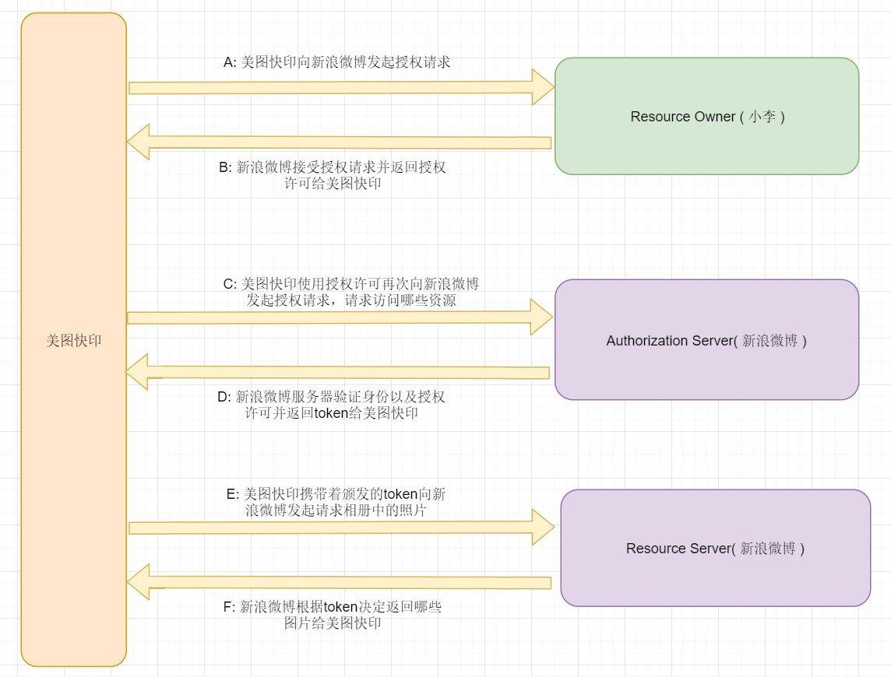

* [1.IdentityServer4是什么？](#1)
* [2.OpenID Connect 和 OAuth2.0是什么？](#2)

[Go to span1](#span1)

#  IdentityServer4是什么？
IdentityServer4是基于ASP.NET Core实现的认证和授权框架，是对OpenID Connect和OAuth 2.0协议的实现。

span1
 
# OpenID Connect 和 OAuth2.0是什么？
 ### OpenID Connect: 
   OpenID Connect由OpenID基金会于2014年发布的一个开放标准, 是建立在OAuth 2.0协议上的一个简单的身份标识层, OpenID Connect 兼容 OAuth 2.0. 实现身份认证（Authentication）    
   参考资料：https://openid.net/connect/    
   OpenID Connect文档：https://openid.net/specs/openid-connect-discovery-1_0.html 
 ### OAuth2.0:  
   OAuth2.0是一个开放的工业标准的授权协议（Authorization），它允许用户授权让第三方应用直接访问用户在某一个服务中的特定资源，但不提供给第三方账号及密码信息    
   参考资料：https://www.cnblogs.com/xiandnc/p/9763121.html    
   OAuth2.0 文档：https://tools.ietf.org/html/rfc6749#page-73
# Authentication 和 Authorization的区别？
    authentication: n. 证明；鉴定；证实
    authorization: n. 授权，认可；批准，委任
    
前者是身份识别，鉴别你是谁；后者是授权许可，告诉你可以做什么。        
举个例子：你吭哧吭哧写了一天的代码，急于回家吃上一口媳妇做的热饭。当你走到小区门口的时候你需要刷小区的门禁卡才能进入到小区里面，然后再找到你家在哪一栋楼，几单元几号，然后掏出钥匙开门才能回到家。在这个过程中刷小区的门禁就是认证你是这个小区的人，拿你家的钥匙开门就是授权的过程，如果你的认证不通过，那就不存在授权。

# OAuth2.0的原理
我们先来了解一下OAuth2.0中的几个关键概念：

#### 资源所有者（Resource Owner）：
    一个能够访问受保护资源的实体。当资源所有者是一个人时，它被称为终端用户

#### 资源服务器（Resource Server）：
    托管受保护资源的服务器，能够使用访问令牌接受和响应受保护的资源请求

#### 客户端（Client）：
    代表资源所有者和其授权的应用程序来保护资源请求。术语客户端并不意味着任何特定的实现特征
    （例如，应用程序是否在服务器、桌面或其他设备上执行）

#### 授权服务器（Authorization Server）：
    在成功验证资源所有者并获得授权之后，服务器向客户端发出访问令牌。
    （授权服务器是用来管理Resource Owner，Resource Server，Client的中间人）

场景：小李想要打印（美图快印）自己三年来发布在新浪微博相册中和女朋友的照片，有没有什么方法他既不告诉工作人员自己的新浪微博用账号和密码又能够方便快捷的把照片给到美图快印呢？（排除存U盘这种手工操作）

Authorization Server和Resource Server可以使独立的服务提供商，也可以是在一起的，比如例子中新浪微博既作授权服务器也用来存储用户的图片资源。我们可以看到OAuth2解决的问题是：通过Authorization Server可以提供一个访问的凭据（token）给client（美图快印的工作人员），使得client可以在不知道Resource Owner以及Resource Server的用户名和密码的情况下访问到Resource Owner受保护的资源，它是一个完美的中间人。　　

OAuth2.0详细内容请参考：https://www.cnblogs.com/xiandnc/p/9763121.html

# IdentityServer4能做什么？

#### 用户认证服务
    基于OpenID Connect实现的独立的认证服务实现对多平台（web, native, mobile, services）的集中认证
#### API访问授权
    为各种类型的客户机颁发api访问令牌，例如服务器到服务器、web应用程序、spa和native/mobile程序
#### 联合身份认证
    支持外部身份提供者，如Azure Active Directory、Google、Facebook等
#### 定制化的实现
    IdentityServer4的许多方面可以定制以满足您的需要,因为它是一个框架，而不是SaaS服务    
    所以可以通过编写代码来调整实现，以适应不同的场景
#### 成熟的开原方案
    使用许可的Apache2开源协议，允许在其之上构建商业产品，也作为.NET基金会支持的项目    
 https://dotnetfoundation.org/projects?type=project&ps=10&pn=6
#### 提供免费的商业支持
    官方可以对使用者提供部分的免费商业支持

# IdentityServer4定义的基本术语

#### IdentityServer
    身份认证服务器是一个实现了OpenID Connect和OAuth 2.0协议的身份提供者，它负责向客户端发布安全令牌    
#### User
    使用注册客户端访问资源的用户
#### Client
    客户端从标识服务器请求令牌，要么用于认证用户（请求身份令牌），要么用于访问资源（请求访问令牌）    
    客户端必须首先在身份服务器上注册，然后才能请求令牌    
    这里的客户端可以是web应用程序、native mobile， desktop applications, SPA 等程序 
#### Resource
    资源是你想要用身份认证服务器保护的东西，如：用户的身份数据或api        
    每个资源都有一个惟一的名称，客户端使用这个名称来指定他们想要访问的资源    
    关于用户的身份数据标识（也称为claim），例如姓名或电子邮件地址
#### Identity Token
    身份令牌代表身份验证过程的结果
#### Access Token
    访问令牌授权客户端以允许访问哪些API资源，访问令牌包含客户端和用户的信息

